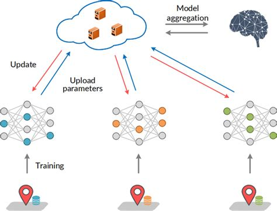

Problem Statement
---
<!-- column_layout: [5, 5] -->

<!-- column: 0 -->

- **Federated Learning (FL)** protects data privacy but faces:
  - Malicious clients poisoning updates
  - Untrusted server tampering with aggregation

<!--pause  -->
- Existing solutions:
  - Rely on partial trust or anomaly detection
  - Limited verification (only client or server, not both)
  - Inefficient due to static proof granularity

<!--pause-->

<!--column: 1-->

<!--end_slide-->

Objectives
---

- Design **dual-verifiable FL framework** using Zero-Knowledge Proofs (ZKPs)
- Implement:
  - **zk-STARKs** → verify client-side local training
  - **zk-SNARKs (Groth16)** → verify server-side aggregation
- Introduce **dynamic proof adjustment** (high/medium/low rigor)
- Ensure **efficiency on resource-constrained devices**
- Validate using **real-world, non-IID datasets**  (eg MedMNIST, UCI HCR)

<!--end_slide-->
Methodology
---

1. **Client-Side Training**
   - Local model updates with SGD
   - Generate zk-STARK proof

<!--pause -->

2. **Server-Side Aggregation**
   - Verify client proofs
   - Aggregate updates (FedJSCM/other)
   - Generate zk-SNARK proof

<!--pause -->

3. **Verification Layer**
   - Proofs checked by **client committee**
   - Option for periodic audits or tamper-evident logs

<!--pause-->

4. **Dynamic Proof Control**
   - Adjusts rigor based on model stability & cost

<!--end_slide-->

Expected Outcomes
---

- **End-to-End Verifiable Federated Learning**
  - Clients + server both provably honest

<!--pause-->
- **Security** against model poisoning & tampering

<!--pause-->
- **Efficiency** via dynamic proof rigor & quantized updates

<!--pause-->
- **Impact**: Privacy-preserving FL for healthcare, finance, and other sensitive domains

<!--end_slide-->

Thank You 🙏
---
